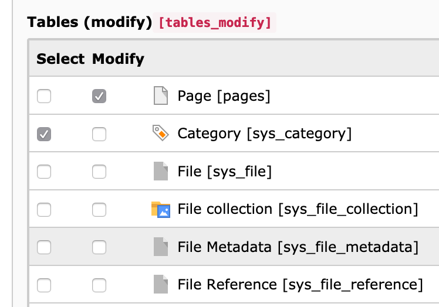
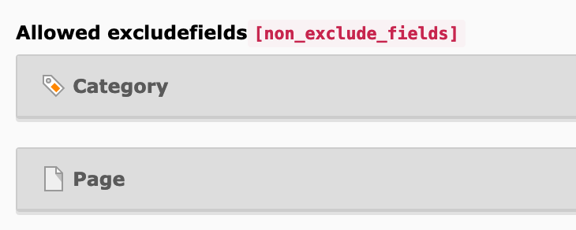
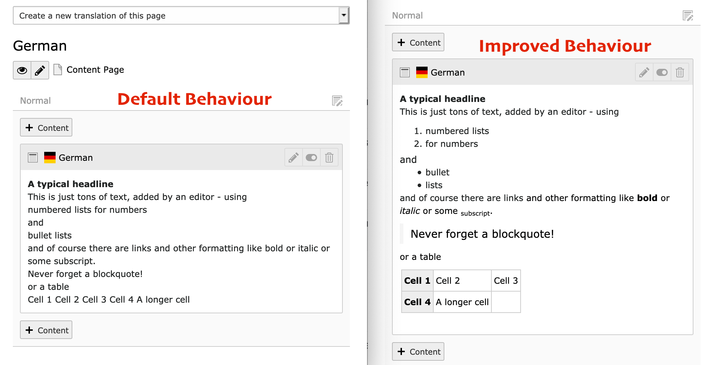
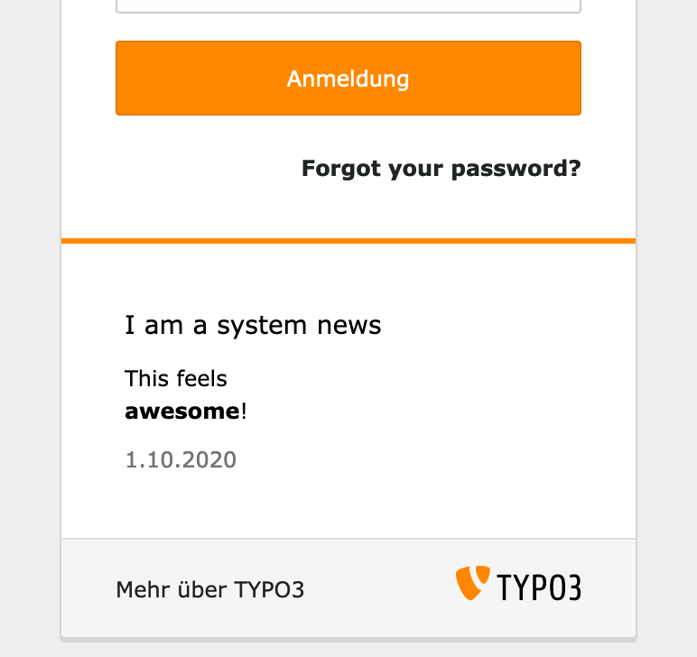

# TYPO3 Extension amazing

This extension improves your daily life as TYPO3 editor and integrator by providing unique features and best practices.

- [How to get it?](#how-to-get-it-)
  * [Why paid?](#why-paid-)
  * [Installation](#installation)
  * [Configuration](#configuration)
- [Features](#features)
  * [Simplify the backend](#simplify-the-backend)
    + [Remove not needed fields from TCA tables](#remove-not-needed-fields-from-tca-tables)
    + [Improve New Record View](#improve-new-record-view)
  * [Improve usergroup permission setup](#improve-usergroup-permission-setup)
    + [Rendering Tables select / modify](#rendering-tables-select---modify)
    + [Show only relevant exclude fields](#show-only-relevant-exclude-fields)
    + [Remove exclude configuration from crucial fields](#remove-exclude-configuration-from-crucial-fields)
  * [Page module](#page-module)
    + [Improved rendering of text](#improved-rendering-of-text)
  * [Misc](#misc)
    + [Improved system news](#improved-system-news)
    + [Expand and Collapse all tables](#expand-and-collapse-all-tables)


## How to get it?

This extension is available for sponsors only. Head over to <https://github.com/sponsors/georgringer/> and select at least the **20 € tier**.

As an alternative I can create an official invoice and propose:
- 75 € for individuals
- 150 € for agencies

*The invoice variant is limited for 1 major version*

**For access or questions, please contact me via [:email: mail@ringer.it](mail@ringer.it), [twitter](https://twitter.com/georg_ringer) or slack**

### Why paid?

Sponsorships allow me to spend more time for TYPO3, no matter if it is about core development, maintaining extensions or giving support on stackoverflow, GitHub or Slack.

### Installation

**- t3x**

Use the provided t3x file and upload it in the extension manager.

**- composer**

With the provided token you can simply do:

```bash
composer config --auth http-basic.georgringer.repo.packagist.com token <your-personal-token>
composer config repositories.private-packagist composer https://georgringer.repo.packagist.com/<your-personal-username>/
composer require georgringer/amazing
```

### Configuration

After finishing the installation, head over to the extension settings and enable all features you want.

## Features

Check out the list of features:

### Simplify the backend

#### Remove not needed fields from TCA tables
The backend contains tons of fields and most of them are important but if a field is really not needed, it is now hidden

- If a site does only use *one* language, **all** language fields of **all** tables are hidden.
- If no category record has been created, the category fields created via the `CategoryRegistry` are hidden.
- If no fe_group record has been created, there is no need for fe_group relations.

#### Improve New Record View

The view *New Record* renders a list of all records which can be created via list module.
The list size has been reduced by:

- Always hide the following records:
  - `backend_layout`: A backend layout should be creating by PageTsConfig
  - `sys_template`: If you still need sys_template records, just use the Template module
  - `sys_news`: See below
- The selection of records `fe_users` and `fe_groups` is only shown if the field `Contains Plugin` on the page is set to *Website Users*.

### Improve usergroup permission setup
Setting up permissions for usergroups is always a big hassle.
This extension will help you save time and reduce mistakes:

#### Rendering Tables select / modify

Permissions on tables are splitted up on read (=select) and write (=modify).
The rendering is improved by rendering both fields next to each other.



#### Show only relevant exclude fields

The field **Allowed excludefields** contains a list of *all* tables with all fields.
In most projects a specific usergroup is created for a specific role, e.g. maintaining events or news records.

Given the example from above, only the list of fields of those 2 tables are shown in this usergroup.




#### Remove exclude configuration from crucial fields

Most fields within the core are defined as exclude field and need to be enabled for every editor.
However, some of those are kind of mandatory to have a working backend - therefore the exclude setting is removed and those fields are available for editors automatically:

```
- pages
  - slug
  - hidden
  - doktype
- tt_content
  - hidden
  - colPos
  - sys_language_uid
```

### Page module

#### Improved rendering of text

By default, text in the pagemodule is being parsed through PHPs `strip_tags()`. The downside is that this removes all the markup and it makes it hard to read the text.



### Misc


#### Improved system news
*10 LTS only*

> System news which are shown below the Backend Login screen and can provide helpful information to other editors.

The news are regular records which need to be created within the backend.
To make those news really usable, they can now be maintained via `AdditionalConfiguration.php`:

```php
$GLOBALS['TYPO3_CONF_VARS']['EXTENSIONS']['amazing']['system_news'] = [
    [
        'header' => 'I am a system news',
        'content' => 'This feels<br><strong>awesome</strong>!',
        'date' => '1.10.2020'
    ]
];
```




Advantages are:
- Deploy and maintain changes just as any code
- Different news depending on the environment

#### Expand and Collapse all tables

A new button in the toolbar of the list module allows expanding and collapsing all tables with one click.
